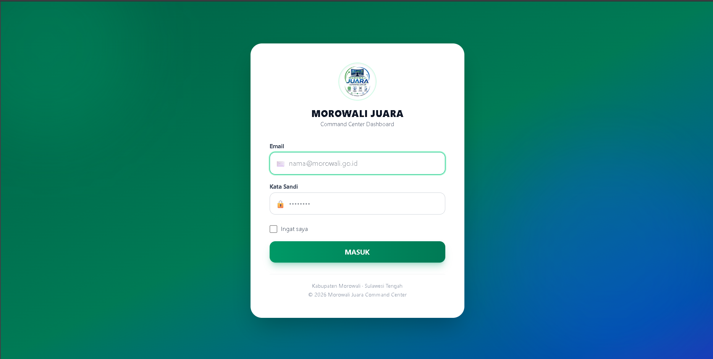
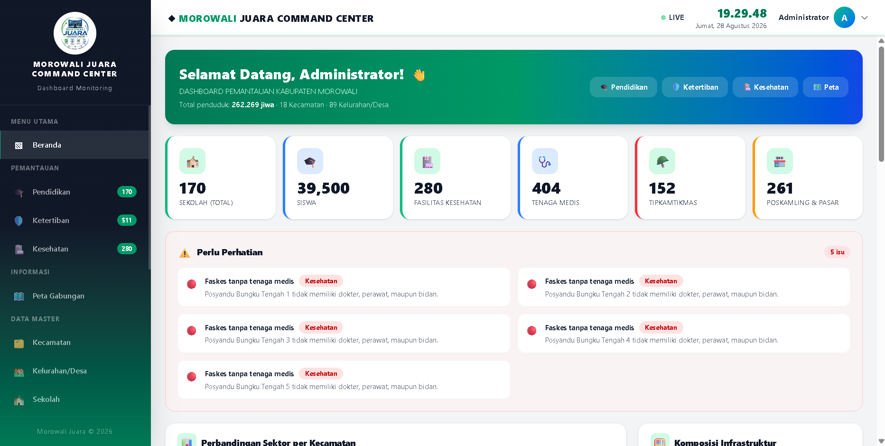
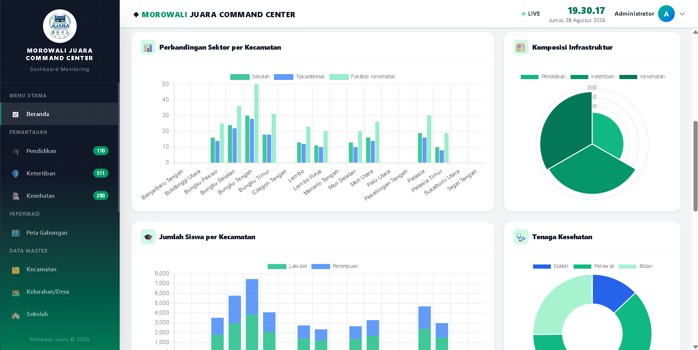
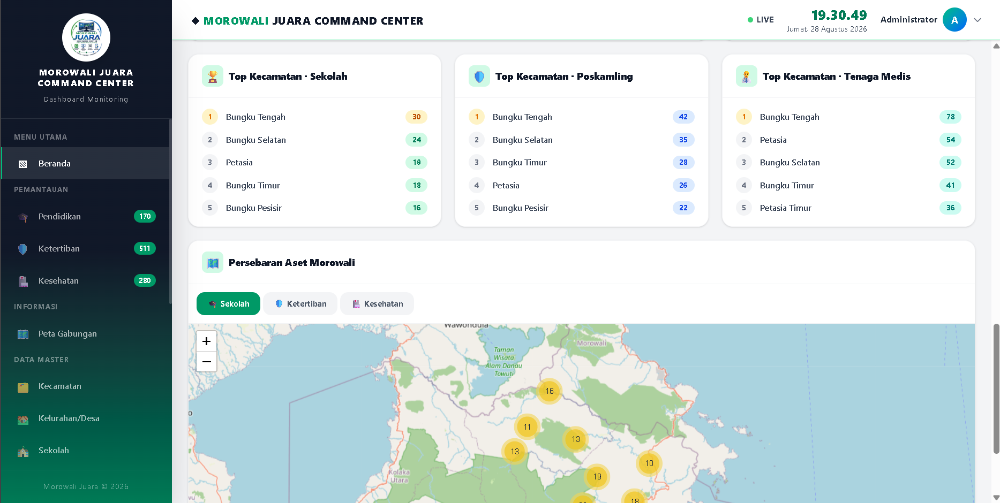
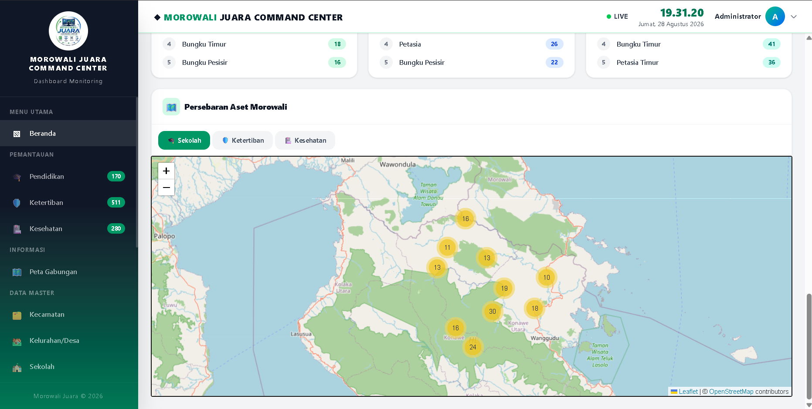

<p align="center">
    
</p>

<h1 align="center">MOROWALI JUARA COMMAND CENTER (MJCC)</h1>

<p align="center">
    Sistem monitoring terintegrasi untuk Kabupaten Morowali, Sulawesi Tengah —
    memantau sektor <strong>Pendidikan</strong>, <strong>Ketertiban</strong>, dan <strong>Kesehatan</strong> dalam satu dashboard.
</p>

---

## 📌 Tentang Proyek

**MJCC (MOROWALI JUARA COMMAND CENTER)** adalah aplikasi web dashboard monitoring yang menghimpun, mengelola, dan memvisualisasikan data sektor publik di Kabupaten Morowali ke dalam satu pusat kendali. Aplikasi ini juga menyediakan **REST API** untuk dikonsumsi aplikasi mobile **Flutter (Android)**.

Dibangun dengan **Laravel 13** (PHP 8.3+) dan dilengkapi **Sanctum** untuk autentikasi API bearer token, serta **Pest** untuk pengujian.

### Fitur Utama
- 🏛️ **Status Morowali (Skor 0–100)** — skor kesehatan wilayah dari agregasi data nyata lintas sektor (Pendidikan, Ketertiban, Kesehatan) dengan aturan yang transparan dan dapat dikonfigurasi.
- 🚨 **Command Alerts** — masalah operasional terdeteksi otomatis dari data lapangan, ditindaklanjuti lewat rangkaian kerja BARU → DITINJAU → DITANGANI → SELESAI, dan ditautkan langsung ke peta.
- 🧭 **Intelijen Kecamatan** — status, skor, dan agregasi operasional per kecamatan, diurutkan berdasarkan data nyata.
- 🔎 **Pencarian Intelijen** — pencarian lintas seluruh data master (sekolah, faskes, keamanan, pasar, kecamatan, kelurahan).
- 🏛️ **Status Keseluruhan & Kesehatan Data** — indikator kunci, peringkat sektor, dan status kesegaran data berdasarkan waktu pembaruan nyata.
- ⏱️ **Auto-refresh Live** — dashboard pusat kendali memuat ulang data secara otomatis (interval dapat dikonfigurasi, dapat diaktifkan/dinonaktifkan per operator).
- 🎓 **Dashboard Pendidikan** — statistik SD/SMP, jumlah siswa & guru, rasio guru, progress fasilitas.
- 🛡️ **Dashboard Ketertiban** — polsek, tipkamtikmas, poskamling, pasar.
- 🏥 **Dashboard Kesehatan** — puskesmas, pustu, rumah sakit, posyandu, tenaga kesehatan.
- 🗺️ **Peta Gabungan** — visualisasi semua lokasi di peta interaktif (aset daerah + titik Data Publik), bisa disaring per sektor/kecamatan.
- 🔔 **Notifikasi Real-time** — lonceng alert (Command Alerts) dan pemantauan SOS yang memperbarui diri lewat polling HTTP.
- 🗂️ **Data Master** — kecamatan, kelurahan/desa, mata pelajaran, sekolah, polsek, tipkamtikmas, poskamling, pasar, fasilitas kesehatan.
- 👤 **Manajemen Pengguna & Role** — `admin`, `operator`, `viewer` (authorization policy + Form Request defense-in-depth).
- ✉️ **Registrasi Publik & Verifikasi Email** — pendaftaran mandiri lewat API (role selalu diset `viewer` oleh backend) dikonfirmasi dengan kode verifikasi 6 digit sekali pakai yang dikirim via email.
- 📜 **Log Aktivitas (Audit Trail)** — setiap aksi tercatat dan password tidak pernah tersimpan di log.
- 📊 **Data Publik (Sumber Eksternal)** — penghimpun data statistik terbuka dari portal Satu Data Morowali (`data.morowalikab.go.id`) untuk sektor Pendidikan, Kesehatan, dan Keamanan, dengan tampilan khusus, sinkronisasi terjadwal, serta resolusi lokasi ke koordinat peta (geocoding).
- 🌐 **API Publik `/api/v1/public`** — endpoint read-only **tanpa token** untuk sektor Pendidikan, Kesehatan, Ketertiban, dan Fasilitas Publik (overview, daftar, dan detail), siap dikonsumsi aplikasi Android.
- 📱 **REST API `/api/v1`** — endpoint lengkap untuk aplikasi Android (Flutter) dengan envelope JSON konsisten.

---

## 🖼️ Tampilan Aplikasi

> Ganti gambar placeholder di bawah dengan screenshot asli Anda (sudah disiapkan di `docs/screenshots/`).

### Halaman Login
<p align="center">
  
</p>

### Dashboard
<p align="center">
  
</p>

<p align="center">
  
</p>

<p align="center">
  
</p>

<p align="center">
  
</p>

---

## 🏗️ Teknologi

| Lapisan | Teknologi |
|---------|-----------|
| Backend | Laravel 13 (PHP 8.3+) |
| Database | MySQL (produksi) / SQLite in-memory (test) |
| Autentikasi API | Laravel Sanctum (bearer token) |
| Frontend | Blade + Tailwind CSS + Alpine.js (Vite) |
| Pengujian | Pest (feature test) |
| Mobile | Flutter (konsumsi REST API) |

---

## 📁 Struktur Proyek

```
app/
├── Http/
│   ├── Controllers/          # Web + API (Api/V1) controllers
│   ├── Requests/             # Form Request (validasi + otorisasi)
│   ├── Resources/            # Eloquent API Resources
│   └── Responses/ApiResponse.php   # Envelope JSON standar
├── Models/                   # Eloquent models
├── Policies/                 # Authorization policies
├── Services/                 # Command center, dashboard, alert, map, public-data scraping services
└── Support/Access.php        # Matriks role admin/operator/viewer

routes/
├── web.php                   # Routing aplikasi web (tidak berubah)
└── api.php                   # REST API /api/v1

docs/
├── API.md                    # Dokumentasi lengkap REST API
├── FLUTTER_API_INTEGRATION.md # Panduan integrasi Flutter
└── screenshots/              # Screenshot aplikasi
```

---

## 🚀 Instalasi (Setup Lokal)

> Persyaratan: PHP 8.3+, Composer, Node.js (npm), dan MySQL.

```bash
# 1. Clone repositori & masuk ke direktori
git clone <repo-url> mjcc && cd mjcc

# 2. Install dependensi
composer install
npm install

# 3. Konfigurasi environment
cp .env.example .env
# Atur kredensial database (db_mjcc) di .env

# 4. Generate key, jalankan migrasi & seeder
php artisan key:generate
php artisan migrate --seed

# 5. Build aset frontend
npm run build

# 6. Jalankan server
php artisan serve
```

Buka `http://localhost:8000` pada browser. Untuk pengembangan frontend secara hot-reload, gunakan `npm run dev` atau `composer run dev`.

> Ini mungkin perlu Anda atur kredensial DB di `.env` sebelum migrasi. Rekomendasi penggunaan seeder/akun awal: periksa `database/seeders/`.

---

## 🧪 Pengujian

```bash
php artisan test --compact   # atau: vendor/bin/pest
```

Suite mencakup pengujian web (dashboard, command center, intelijen kecamatan, search, peta, SOS, CRUD, trash/restore, audit, profil, data publik) plus pengujian API (autentikasi, registrasi & verifikasi email, otorisasi per role, dashboard, peta).

---

## 📱 REST API untuk Flutter

Aplikasi menyediakan API lengkap di prefix `/api/v1`:

- **Autentikasi & Pendaftaran:** `POST /api/v1/login`, `POST /api/v1/logout`, `GET /api/v1/me`, `POST /api/v1/register`, `POST /api/v1/email/verify`, `POST /api/v1/email/verification/resend`
- **Dashboard:** `/api/v1/dashboard`, `/education`, `/security`, `/health`
- **Peta:** `/api/v1/maps`
- **CRUD:** schools, polseks, tipkamtikmas, poskamlings, markets, health facilities, kecamatans, kelurahans, subjects, users
- **Audit log (admin):** `/api/v1/audit`
- **Data Publik (tanpa token):** `/api/v1/public/overview` + daftar/detail `schools`, `health-facilities`, `polseks`, `poskamlings`, `tipkamtikmas`, `markets`, `kelurahans`

Setiap request selain `login`, `register`, `email/verify`, `email/verification/resend`, dan seluruh endpoint `/api/v1/public/*` membutuhkan header `Authorization: Bearer <token>` dan `Accept: application/json`.

📖 Dokumentasi lengkap: [`docs/API.md`](docs/API.md)
📱 Panduan integrasi Flutter: [`docs/FLUTTER_API_INTEGRATION.md`](docs/FLUTTER_API_INTEGRATION.md)

---

## 🔐 Role & Otorisasi

| Akses | Admin | Operator | Viewer |
|-------|:---:|:---:|:---:|
| Melihat data & dashboard | ✅ | ✅ | ✅ |
| CRUD data operasional | ✅ | ✅ | ❌ |
| Restore soft-delete | ✅ | ✅ | ❌ |
| Kelola status alert (follow-up) | ✅ | ✅ | ❌ |
| Kelola user, kecamatan, audit | ✅ | ❌ | ❌ |
| Hapus permanen (force-delete) | ✅ | ❌ | ❌ |

---

## 📄 Lisensi

MIT License — bebas digunakan dan dimodifikasi.
